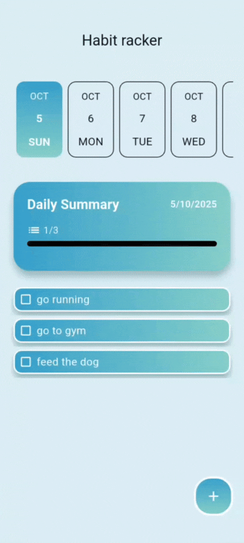

# Habit Tracker

## 1. Project Overview

A lightweight, distraction-free app to track daily habits and visualize progress. Focused on clarity and usability without the overhead of complex trackers.  

### Key Features
- **Daily Progress Bar**  
  Immediate visual feedback on daily habit completion, boosting motivation.  

- **Scrollable Date Picker**  
  Quick navigation to past and upcoming dates for easy review and planning.  

- **Smooth Animations**  
  Subtle animations for natural, modern transitions without clutter.  

---

## 2. Tech Stack
- Flutter  
- Riverpod + StateNotifier  
- Drift (SQLite)  
- Clean Architecture  

---

## 3. Implementation

### State Management (Riverpod + StateNotifier)
- Compile-time safety and simplified dependency injection.  
- StateNotifier ensures immutable updates and clean separation of logic from UI.  

### Database (Drift / SQLite)
- Type-safe, reactive abstraction over SQLite.  
- Auto-generated schema and queries guarantee strong typing and reliable operations.  

### Clean Architecture
- Separation into **Data**, **Domain**, and **Presentation** layers.  
- Easy to maintain, test, and extend (e.g., adding cloud sync).  

---

## 4. Future Improvements
- Habit reminders and notifications.  
- Separate page for each habit with editing and a monthly overview of completion.  
- Mobile home screen widget to quickly view habits and tasks.  
- Custom color and icon support for each habit.
---

## 5. Demo

